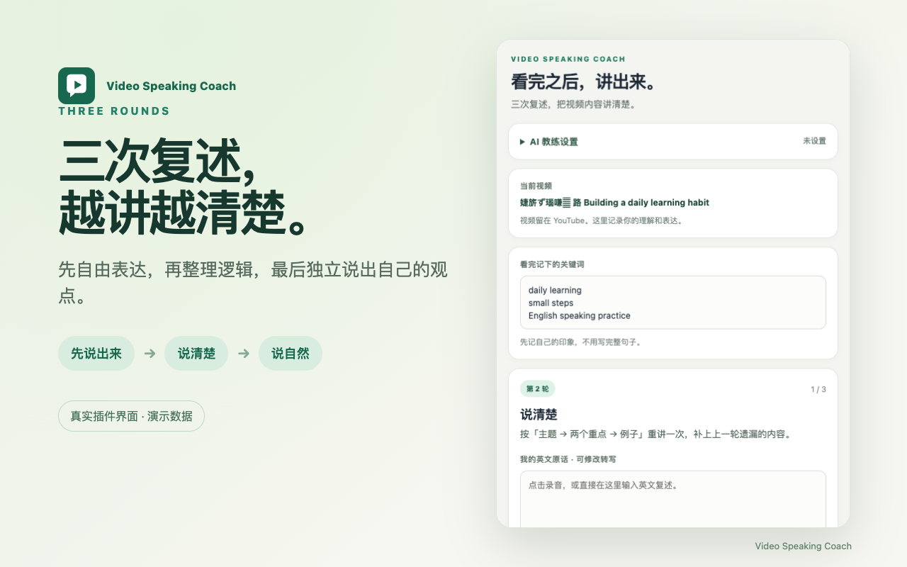

# Video Speaking Coach｜看完之后，讲出来

不知道怎样练英语口语？选一段感兴趣的 YouTube 视频作为输入，看完记下关键词，先只看这些词、用自己的声音把它们串成英文，再跟着侧边栏复述三次：**先说出来 → 说清楚 → 说自然**。插件记录每轮原话和建议，帮助你把“听懂”变成“讲清楚”。

> 这是正在准备上架的开源 Chrome 扩展。截图使用虚构演示数据。目前可通过“加载已解压的扩展程序”安装；Chrome Web Store 链接将在审核通过后补充。

## 为什么做

很多人找得到英语视频，却不知道看完后如何有效开口。这个项目把“输入 → 关键词提取 → 主动输出 → 反馈 → 再输出”做成一套能直接执行的流程。第一轮不照读范文：只看自己记下的关键词，用语音讲出理解，再逐轮补上结构和个人观点。视频由你自己选择和观看，插件不替你生成整篇复述。详见[练习方法](METHODOLOGY.md)。

## 功能

- 关联当前 YouTube 视频，记录关键词，并自动恢复本地进度。
- 三轮复述，支持浏览器语音识别和可修改的英文转写，也能直接打字。每轮 AI 建议按“问题 → 原因 → 完整英文重讲示例 → 下一轮动作”呈现。
- 每轮保存原话与反馈；可重新练习并保留旧尝试。
- 基础查词无需 API Key；个性化建议、语境查词和问答支持用户自己的 OpenAI 或阿里云百炼普通 API Key。服务商可能按量收费。
- 三轮完成后导出 Markdown；可手动导入 Notion，或写入 Obsidian。

目前**没有**自动视频摘要、字幕抓取、量化发音评分、任意厂商 API Key 接入或 Notion 直接同步。

## 安装与使用

1. 下载或克隆本仓库，在桌面 Chrome 打开 `chrome://extensions`。
2. 开启“开发者模式”，点击“加载已解压的扩展程序”，选择仓库中的 `extension/` 目录。
3. 打开一段 YouTube 视频并点击扩展图标。看完视频记下关键词，然后完成三轮英文复述。
4. 若需 AI 建议，展开“AI 教练设置”，选择服务商，点击官网入口获取 API Key，复制回来保存。不设置也能完成基础练习。

详细步骤与常见问题见[完整使用教程](USER_GUIDE.md)。扩展本身没有构建步骤，当前仅面向桌面 Chrome。

## 数据与费用

练习记录保存在本机 Chrome 扩展存储中，扩展不保存原始音频。语音转写由浏览器提供，可能使用线上识别服务。基础查词会把查询词发送给 MyMemory；启用 AI 时，用户主动提交的相关文字会发送给所选服务商。API Key 仅保存在当前 Chrome 会话中。详见[隐私政策](PRIVACY_POLICY.md)。

插件本身与基础练习不要求购买课程。符合条件的服务商免费额度可以使用；额度、期限、价格和地区均由服务商决定。不要把“自带 Key”理解为任意 API Key 均兼容。

## 开源与反馈

如果这个练习方法帮你开始开口，欢迎点击仓库右上角 **Star**，也欢迎通过 [Issues](https://github.com/tian1363/video-speaking-coach/issues) 反馈体验。请勿公开提交 API Key 或未脱敏的练习内容。贡献方式见 [CONTRIBUTING.md](CONTRIBUTING.md)，教学流程另有可复用的 [Codex Skill](skills/youtube-speaking-coach/SKILL.md)。项目采用 [MIT License](LICENSE)。
